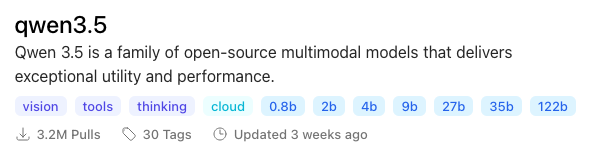

# Kode

Agentic coding tool designed for LLMs with small context windows

## Requirements
[Ollama](https://ollama.com/) must be installed for Kode to be able to use models

### What model do use
The Ollama model must support tool calling

The model must have the "tools" tag

### Recommended local models

#### Lighter
- [Qwen 3.5 4B](https://ollama.com/library/qwen3.5:4b)

#### Heavier
- [Qwen 3.5 9B](https://ollama.com/library/qwen3.5:9b)
- [Ministral 3 8B](https://ollama.com/library/ministral-3:8b)

